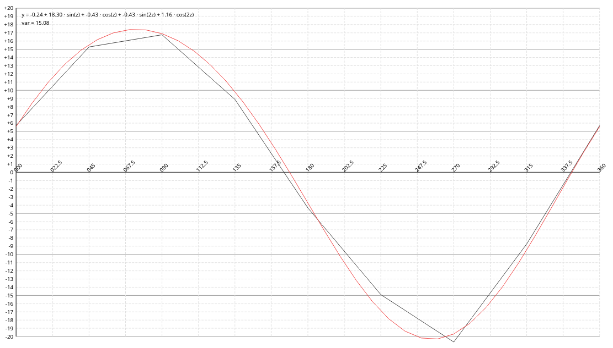

# Calculating a Compass Deviation Curve

This program calculates a deviation curve for the magnetic steering compass of
your vessel.  Such a diagram is necessary for navigation with traditional
(non-GPS) navigation methods.  This program calculates and interatively
approximates the curve according to your measurement.

The following picture shows an example. The black curve is what was measured at
12 distinct courses and the red line shows the smooth estimation. To get a
proper result you have to measure (see below) at least 4 but better 8 or more
values.



## The Measurement

You have to do some measurements at first. You need to do this in a calm sea
without any currents[^1] and you need to be able to determine the true course which is
most easily done today with any chart plotter viewing the COG value (or any
other GPS device).

Now steer a straight course with at least 4 knots of speed. You may use the
autopilot. Once to boat does not deviate from the straight line (look at the
background, mountains, islands, or whatever) read the compass course from your
steering compass and the COG value from your plotter. Write down both values in a table.
Now repeat this for every 45 degrees of a full circle. You probably should
repeat the first measurement just to check for an error at the first try ;)

Finally you should end up with a table with 8 value pairs like the following example:

```
C   010   060   090   135   180   225   270   315 
T   015   084   101   137   177   220   268   316
```

## Calculate the Deviation

Now we can calculate the deviation for each value pair. You can do this either

manually or in a spread sheet.
Let *C* be the compass reading and *T* be the COG. Since the compass depends on the
magnetic field you need to know the magnetic variation in your area. This is
constantly changing with the years and you find this information in an
appropriate seachart or a proper navigation software. E.g. in the Adriatic Sea
this currently is 4 degrees East which is +4 (western variations being
negative). Let *V* be the variation.

To calcute the deviation *D* you use the following formula:

*D = T - V - C*

**Example:** Let's assume I did this measurement in the Adriatic Sea, hence the
magnetic variation *V = 4*. For the 1st column I do the following calculation:

*D = 15 - 4 - 10 = 1*

```
C   010   060   090   135   180   225   270   315 
T   015   084   101   137   177   220   268   316
D     1    10     7    -1    -7    -9    -6    -3
```

Now from this make a JSON-like structure of the following format:

```
hdg0:dev0, hdg1:dev1, hdg2:dev2,...
```

Example from above would be the following string:

```
10:1,60:10,90:7,135:-1,180:-7,225:-9,270:-6,315:-3
```

C&P this string into the textarea above the diagram or edit the HTML file and
put it into the text area there.

# Author

Bernhard R. Fischer <bf@abenteuerland.at>
Version 1.0, 2023/04/10


[^1]: I have a current correction in the C-variant of this program but didn't
  implement it yet here in the JS version.

